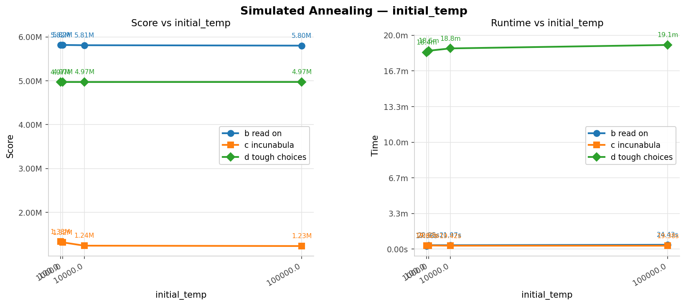
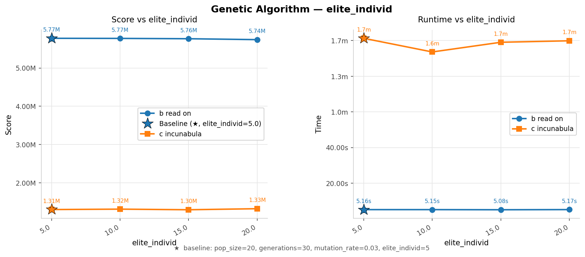
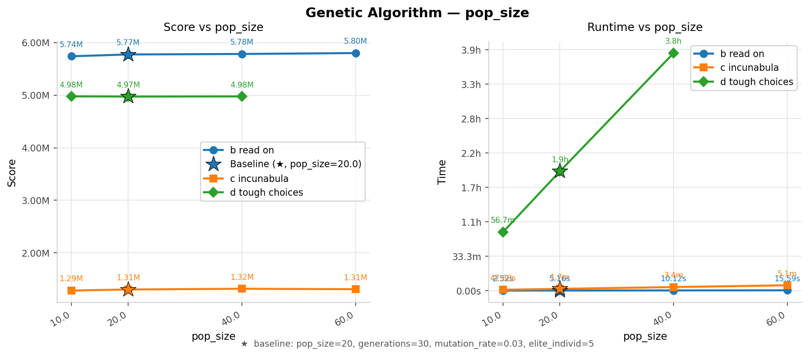
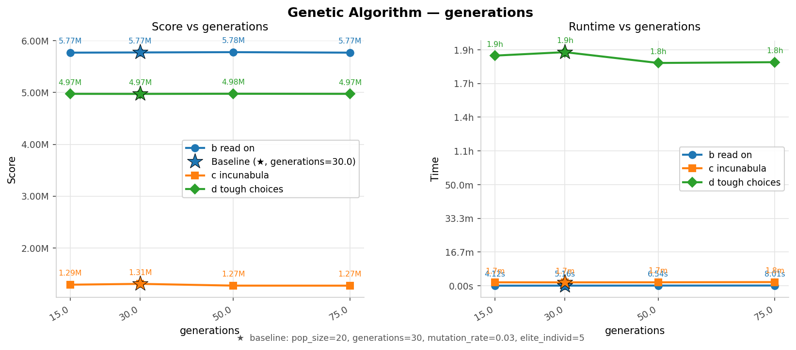
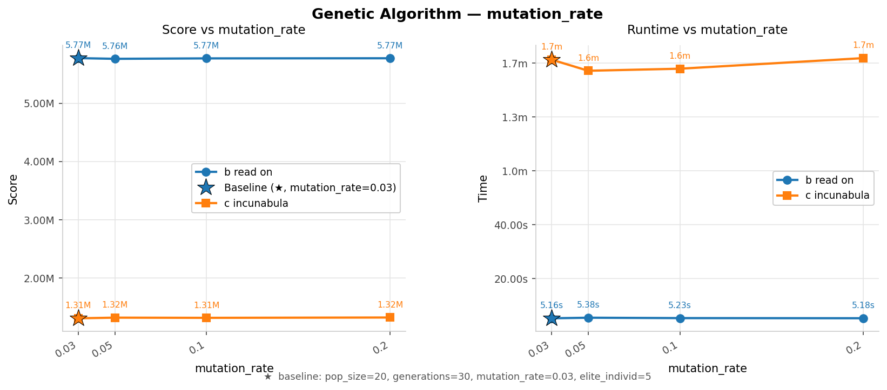
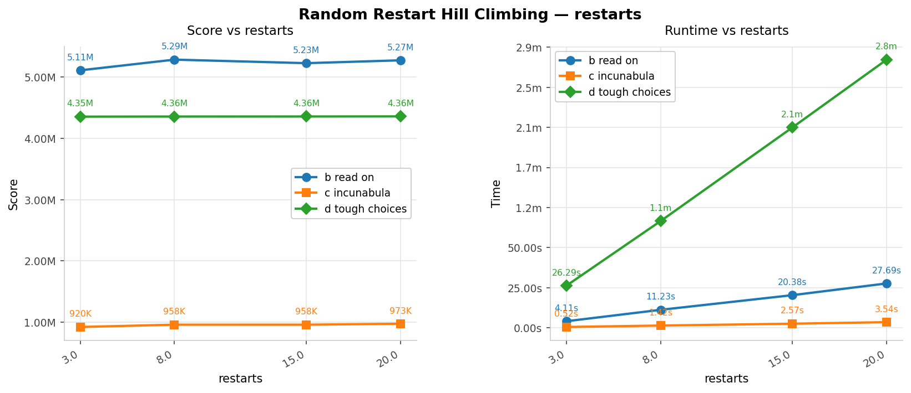
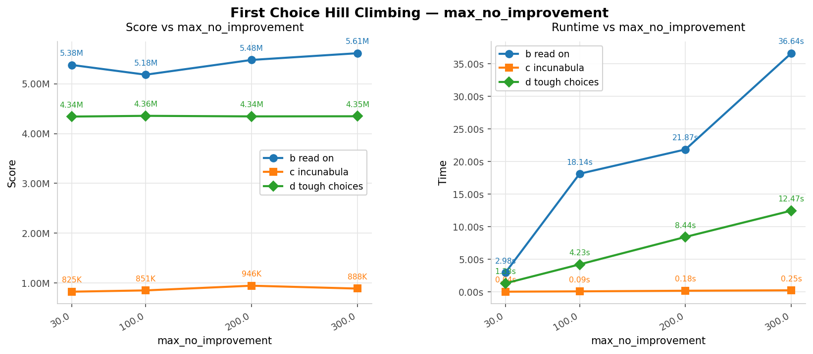
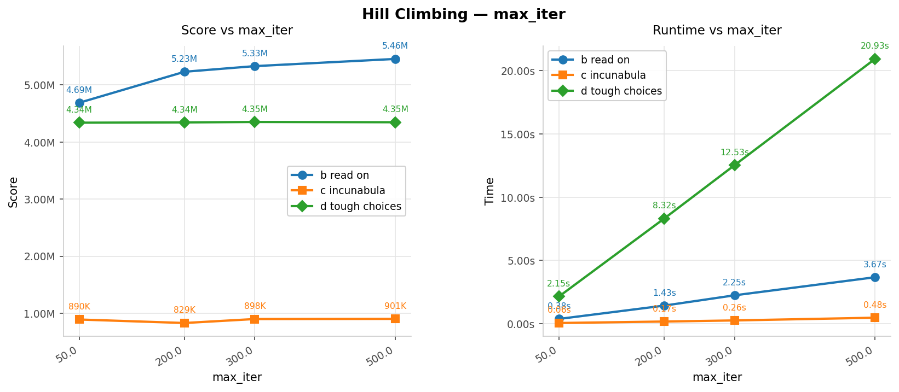
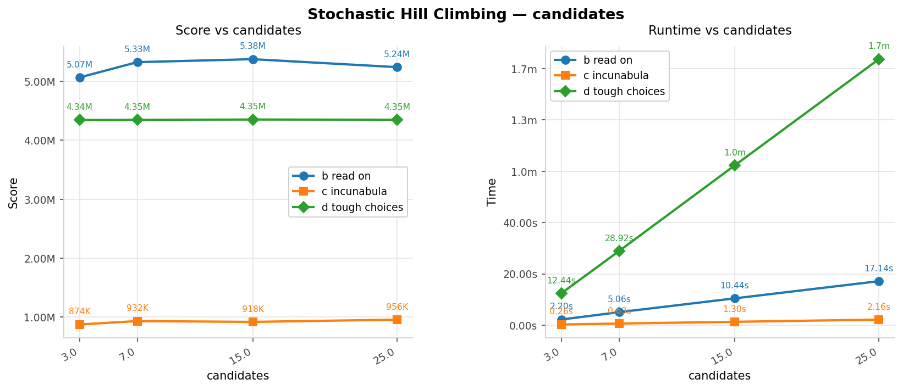

# AI PROJECT 1 (2025/2026)
# Book Scanning Optimization Problem

## Made by
Tiago Oliveira 202304762  
Guilherme Triães  202304594  
Carlos Cristelo 202307628  

## How to Run the App
<code>
cd P1/src
pip install -r requirements.txt
python main.py
</code> 
Choose the file you want to test and the respective algorithm. Then run the selected algorithm. 

# Problem Specification

There are L libraries, identified from 0 to L−1. Each library contains a set of books, a signup time (in days), and a number of books that can be scanned per day.

There are B books, identified from 0 to B−1. A book may appear in more than one library but can only be scanned once.

There are D days available (day 0 to day D−1). The first signup can start on day 0, and no signup can finish after day D.

All libraries must be signed up before they can begin scanning books.

The objective is to maximize the total score of scanned books before the deadline.

# Problem Formulation

## Solution Representation

An ordering (permutation) of libraries with their respective books defines the signup order.

Example:

[L2: {B1, B2}, L5: {B3, B5}, L1: {B6, B7}]

## Initial State

Random or heuristic-generated ordering of libraries.

## Hard Constraints

- Only one library can sign up at a time
- Signup + scanning must fit within the deadline
- Each book can only be scanned once
- Daily scan limit equals the library shipping capacity

## Evaluation Function

Simulate the scanning process and sum the scores of scanned books.

Objective: maximize total score

## Neighborhood / Operators

Hill Climbing

Random selection between:

- swapping two libraries
- reversing the order of a segment
- moving one library to another position (shifting the segment)

Genetic Algorithm

- Selection: tournament selection
- Crossover: order crossover
- Mutation: swap / reverse / insertion

## Heuristic Function

Estimate the score of each library based on:

- remaining days
- shipping capacity
- scores of unscanned books

This heuristic is used to guide the initial solution and the Genetic Algorithm population.

# Analysis

The group decided to measure the score and execution time using three different datasets (B, C, and D), using a script not present in this repository.

The following parameters were analyzed:

Simulated Annealing

- Initial temperature

Stochastic Hill Climbing

- Number of candidates

Random Restart Hill Climbing

- Number of restarts

Hill Climbing

- Maximum iterations

First-Choice Hill Climbing

- Maximum number of neighbors without improvement

Genetic Algorithm

- Population size
- Mutation rate
- Number of elite individuals
- Number of generations

# Simulated Annealing

## Conclusions

We conclude that varying the initial temperature had almost no effect on the score. However, for Dataset D, it increased execution time by approximately 2 minutes.

# Genetic Algorithm

## Number of Elite Individuals

## Population Size

## Number of Generations

## Mutation Rate

### Important Note

| dataset                  | algorithm         | varied_param | param_variant | run | parameters                                                                 | score   | runtime_s     |
|--------------------------|------------------|-------------|--------------|-----|---------------------------------------------------------------------------|---------|--------------|
| b_read_on                | genetic_algorithm | pop_size     | 1            | 1   | pop_size=50; generations=100; mutation_rate=0.03; elite_individ=5         | 5802700 | 24.038846    |
| b_read_on                | genetic_algorithm | pop_size     | 1            | 2   | pop_size=50; generations=100; mutation_rate=0.03; elite_individ=5         | 5804300 | 24.243881    |
| b_read_on                | genetic_algorithm | pop_size     | 1            | 3   | pop_size=50; generations=100; mutation_rate=0.03; elite_individ=5         | 5808200 | 24.473840    |
| c_incunabula             | genetic_algorithm | pop_size     | 1            | 1   | pop_size=50; generations=100; mutation_rate=0.03; elite_individ=5         | 1324719 | 279.024321   |
| c_incunabula             | genetic_algorithm | pop_size     | 1            | 2   | pop_size=50; generations=100; mutation_rate=0.03; elite_individ=5         | 1352179 | 272.309468   |
| c_incunabula             | genetic_algorithm | pop_size     | 1            | 3   | pop_size=50; generations=100; mutation_rate=0.03; elite_individ=5         | 1309945 | 264.655669   |
| d_tough_choices          | genetic_algorithm | pop_size     | 1            | 1   | pop_size=50; generations=100; mutation_rate=0.03; elite_individ=5         | 4977375 | 17383.082501 |
| d_tough_choices          | genetic_algorithm | pop_size     | 1            | 2   | pop_size=50; generations=100; mutation_rate=0.03; elite_individ=5         | 4976530 | 17346.832234 |
| d_tough_choices          | genetic_algorithm | pop_size     | 1            | 3   | pop_size=50; generations=100; mutation_rate=0.03; elite_individ=5         | 4976400 | 17879.330370 |
| e_so_many_books          | genetic_algorithm | pop_size     | 1            | 1   | pop_size=50; generations=100; mutation_rate=0.03; elite_individ=5         | 2424580 | 31.823882    |
| e_so_many_books          | genetic_algorithm | pop_size     | 1            | 2   | pop_size=50; generations=100; mutation_rate=0.03; elite_individ=5         | 2430306 | 32.265041    |
| e_so_many_books          | genetic_algorithm | pop_size     | 1            | 3   | pop_size=50; generations=100; mutation_rate=0.03; elite_individ=5         | 2424628 | 30.960682    |
| f_libraries_of_the_world | genetic_algorithm | pop_size     | 1            | 1   | pop_size=50; generations=100; mutation_rate=0.03; elite_individ=5         | 2738055 | 12.977565    |
| f_libraries_of_the_world | genetic_algorithm | pop_size     | 1            | 2   | pop_size=50; generations=100; mutation_rate=0.03; elite_individ=5         | 2486730 | 12.665144    |
| f_libraries_of_the_world | genetic_algorithm | pop_size     | 1            | 3   | pop_size=50; generations=100; mutation_rate=0.03; elite_individ=5         | 3114275 | 14.027180    |

## Conclusions

Increasing the population size produced a 10% score improvement on Dataset B, while showing no significant difference for the remaining datasets. However, runtime increased approximately linearly with population size.

Varying the remaining parameters did not significantly affect either runtime or score.

# Hill Climbing

## Random Restart (Number of Restarts)

## First Choice (Maximum Number of Neighbors Without Improvement)

## Hill Climbing (Maximum Iterations)

## Stochastic Hill Climbing (Number of Candidates)

## Conclusions

Varying the parameters across all Hill Climbing algorithms revealed a linear relationship between parameter size and execution time, with only minor variations in score.

An exception occurred for Dataset B, where increasing parameter values produced a reasonable improvement in score.

# Final Conclusion

Based on the information obtained from the graphs, we can conclude that Hill Climbing algorithms achieved lower scores than the Genetic Algorithm and Simulated Annealing approaches.