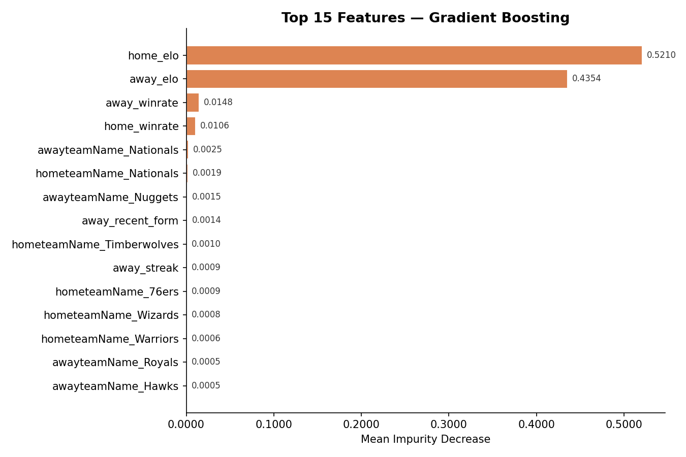
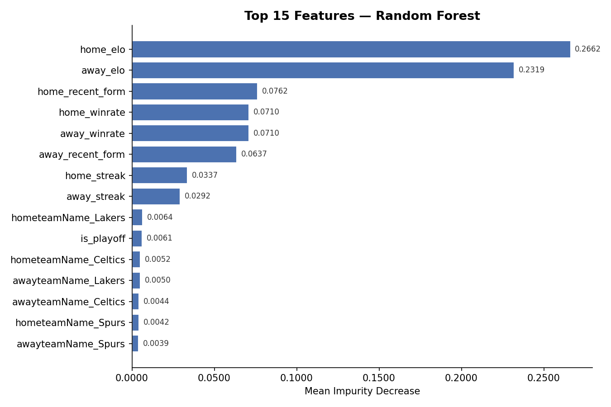
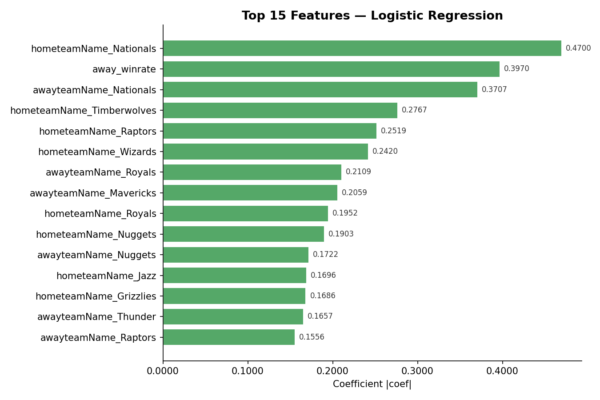

# NBA Game Outcome Predictor - L.EIC IART Project 2


**Carlos Lisboa Cristelo** up202307628<br>
**Guilherme Triães** up202304594<br>
**Tiago Oliveira** 202304762 <br>


## How to Run 

Windows:

``` bash
pip install -r requirements.txt
cd P2/src
python .\train.py
python -m streamlit run .\app.py
```
Nix:

``` bash
cd P2/src
./requirements_nix.sh
```


<!-- ## Índice

- [Visão Geral](#visão-geral)
- [Estrutura do Projeto](#estrutura-do-projeto)
- [Dataset](#dataset)
- [Features](#features)
- [Modelos](#modelos)
- [Resultados Empíricos](#resultados-empíricos)
- [Feature Importance](#feature-importance)
- [Como Correr](#como-correr)
- [App Streamlit](#app-streamlit)
- [Stakeholders](#stakeholders)
- [Limitações e Desafios](#limitações-e-desafios)
- [Riscos Éticos](#riscos-éticos)

--- -->

## Visão Geral

Este projeto desenvolve um classificador de machine learning que prevê a **probabilidade da equipa da casa ganhar** um jogo da NBA, usando dados históricos e features contextuais (1945–2026).

A solução foi criada para o **Los Angeles Lakers Basketball Club**, em colaboração com o treinador JJ Redick e o seu staff de suporte 

O problema: as decisões actuais dependem da experiência do treinador e de estatísticas simples, não existe nenhum sistema que produza uma probabilidade de vitória clara e automatizada para um dado confronto.


## Dataset

Os dados combinam jogos reais com jogos sintéticos:

- **`datasets/Games.csv`** - 70 mil linhas de partidas reais de jogos NBA
- **`datasets/GamesFake.csv`** - gerado por `P2/src/data.py`, que amostra equipas reais, simula pontuações com base nas distribuições históricas (média +- desvio padrão) e atribui datas entre 2027/28.
<!-- 
> **Nota anti-leakage:** os dados são ordenados cronologicamente antes de qualquer divisão treino/teste. As features de cada jogo são calculadas apenas com informação *anterior* a esse jogo. -->

### Geração de dados sintéticos

O script `data.py`:
1. Lê `Games.csv` e extrai todas informação como  equipas, arenas e árbitros existentes.
2. Para cada jogo , escolhe duas equipas distintas, gera pontuações usando `np.random.normal(mean, std)` com os parâmetros históricos.
3. Evita empates ajustando ajustando a pontuação quando necessário.
4. Replica a distribuição de tipos de jogoda proporção real.
5. Exporta para `GamesFake.csv` com o mesmo schema do ficheiro original.

---

## Features

Todas as features são calculadas **antes de cada jogo** para não haver data leakage.

| Feature | Descrição |
|---|---|
| `home_winrate` / `away_winrate` | Taxa de vitórias acumulada até ao momento |
| `home_recent_form` / `away_recent_form` | Média ponderada dos últimos 5 resultados |
| `home_elo` / `away_elo` |  ELO atualizado após cada jogo |
| `home_streak` / `away_streak` | Sequência de vitórias consecutivas atual |
| `is_playoff` | Flag binária: 1 se for jogo de Playoffs, 0 se Regular Season |
| One-hot team IDs | Codificação das equipas via `OneHotEncoder` |

### ELO

```python
expected_home = 1 / (1 + 10 ** ((away_rating - home_rating) / 400))
actual_home   = 1 if winner == home_id else 0
K = 32

elo[home_team] += K * (actual_home - expected_home)
elo[away_team] += K * ((1 - actual_home) - (1 - expected_home))
```

### Recent Form 

```python
home_history = recent_results[home_team][-5:]
weights      = np.arange(1, len(home_history) + 1) 
home_form    = np.average(home_history, weights=weights)
```

---

## Modelos

Foram usados 3 modelos de ML no  `train.py`:

### Gradient Boosting 
```python
GradientBoostingClassifier(
    n_estimators=100,
    learning_rate=0.05,
    subsample=0.8,
    random_state=42,
)
```

### Random Forest
```python
RandomForestClassifier(
    n_estimators=300,
    max_depth=12,
    min_samples_split=5,
    class_weight='balanced',
    random_state=42,
)
```

### Logistic Regression 
```python
LogisticRegression(
    C=1.0,
    max_iter=1500,
    class_weight='balanced',
    solver='liblinear',
    random_state=42,
)
```


### Divisão treino/teste

Os primeiros 80% dos jogos são usados para treino e os últimos 20% para teste. Esta divisão temporal simula o uso real do projeto e previne data leakage : o modelo nunca preve o futuro.


## Resultados Empíricos

**Métrica principal:** F1-score para a classe positiva (vitória da equipa da casa).

| Modelo | F1-Score   |
|---|---|
| Gradient Boosting | 0.730  |
| Random Forest | 0.668  |
| Logistic Regression | 0.656  |

### Conclusões do tuning de hiperparâmetros

**Gradient Boosting** - `n_estimators` mais alto baixou o F1, porque adicionar árvores sem reduzir o `learning_rate` aumentou a variância .

**Random Forest** - `max_depth` maior aumentou o F1 consistentemente.

**Logistic Regression** - `C` maior baixou o F1.Reduzir a regularização aumentou a variância e prejudicou a generalização.

---

## Feature Importance

### Cálculo
**Random Forest e Gradient Boosting**

```python
rf_importance = pd.DataFrame({
    "Feature":    feature_names,
    "Importance": model1.feature_importances_,
}).sort_values(by="Importance", ascending=False)
```

<br>



O Random Forest deu maior importância ao home_elo e away_elo porque o ELO representa a força global das equipas ao longo do tempo. Como este modelo cria árvores de decisão, o ELO torna-se útil para separar equipas fortes de equipas fracas.<br>
O Gradient Boosting também utilizou principalmente o ELO, pois este modelo aprende iterativamente os padrões que melhor reduzem o erro. Como o ELO está fortemente relacionado com a probabilidade de vitória, o modelo usa esta feature durante o treino.
**Logistic Regression** 

```python
lr_importance = pd.DataFrame({
    "Feature":    feature_names,
    "Importance": np.abs(model3.coef_[0]),
}).sort_values(by="Importance", ascending=False)
```

Os `feature_names` são construídos da seguinte forma:

```python
team_feature_names    = team_encoder.get_feature_names_out(['hometeamName', 'awayteamName'])
numeric_feature_names = ['home_winrate', 'away_winrate', 'home_recent_form',
                         'away_recent_form', 'is_playoff', 'home_streak',
                         'away_streak', 'home_elo', 'away_elo']
feature_names = list(team_feature_names) + numeric_feature_names
```




<p> A Logistic Regression destacou o away_winrate e a equipa "Nationals" porque é um modelo linear que aprende coeficientes diretamente para cada feature. Sendo que away_winrate tem forte relação com o resultado, enquanto "Nationals" surgiu devido ao One-Hot Encoding. Como o modelo é sensivel a correlações diretas, equipas com padrões estatísticos muito consistentes  recebem coeficientes elevados.
---

## Como Correr

### 1. Instalar dependências

```bash
pip install -r requirements.txt
```


### 2. Gerar dados sintéticos

```bash
cd P2/src
python data.py
```


### 3. Treinar os modelos

```bash
python train.py
```


### 4.Correr a app

```bash
streamlit run P2/src/streamlit_app.py
```

---

## App Streamlit

A dashboard (`streamlit_app.py`) permite:

- Comparar os três modelos numa tabela de métricas.
- Selecionar o modelo desejado para previsão.
- Visualizar as **top 15 features** do modelo selecionado.
- Escolher equipa da casa e equipa visitante e se o jogo é Playoff.
- Ver contexto do confronto: histórico dos últimos 10 jogos entre as 2 equipas, streaks actuais.
- Obter a **probabilidade de vitória** para cada equipas.


## Limitações e Desafios

### Técnicos
- Dados limitados para condições de jogo raras 
- Model drift ao longo das épocas (mudanças de roster, regras, estilo de jogo)
- Latência e escala para previsões em tempo real

### Organizacionais
- Construir confiança do treinador em recomendações probabilísticas
- Integrar outputs probabilísticos nos fluxos de decisão existentes

### Dados não disponíveis
- **Player tracking** - possibilitaria modelos ao nível de posse
- **Relatórios de lesão detalhados, logs de treino e tagging tático play-by-play** - melhoraria a inferência

---

## Riscos Éticos

- **Risco de dependência excessiva:** os outputs do modelo devem *informar*, não *substituir*, o julgamento do treinador.
- **Viés histórico:** biases de seleção presentes nos dados históricos (tempo de jogo, era, composição de equipas) podem distorcer as previsões - explainability e supervisão humana são essenciais.


